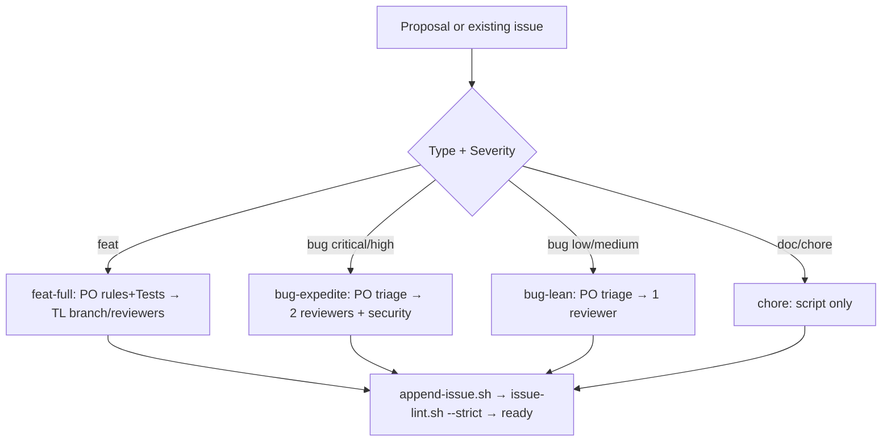
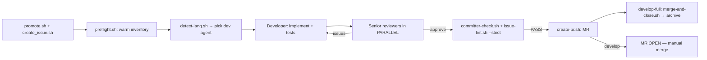

# OpenCode Project Configuration

[](https://github.com/pereirawe/opencode-flow/releases)
[](LICENSE)
[](CONTRIBUTING.md)
[](https://github.com/pereirawe/opencode-flow/stargazers)
[](https://github.com/pereirawe/opencode-flow/commits/main)
[](https://github.com/pereirawe/opencode-flow/discussions)

**Version:** 2.1.0 — [License](LICENSE) (MIT)

Configuração multi-setor para OpenCode com agentes C-level, skills especializadas
e pipeline de desenvolvimento completo. Vive em `~/.config/opencode/` e é
carregado automaticamente como **config global**.

## Installation

### Quick install (curl | bash)

```bash
curl -fsSL https://raw.githubusercontent.com/pereirawe/opencode-flow/main/install.sh | bash
```

With options:

```bash
curl -fsSL https://raw.githubusercontent.com/pereirawe/opencode-flow/main/install.sh | bash -s -- --branch=v1.0.0 --dir=$HOME/.config/opencode
```

### Manual

```bash
git clone --depth 1 https://github.com/pereirawe/opencode-flow ~/.config/opencode
```

## Updating

```bash
bash ~/.config/opencode/scripts/update.sh          # update to latest
bash ~/.config/opencode/scripts/update.sh --check   # check only
```

Or via Make:

```bash
make -C ~/.config/opencode update
```

## Structure

## Estrutura

| Caminho | Propósito |
|---------|-----------|
| `AGENTS.md` | Entrypoint instructions |
| `opencode.json` | Configuração OpenCode + comandos + permissões |
| `workflow.md` | Pipeline de desenvolvimento (descoberta → MR) |
| `architecture.md` | Visão técnica e decisões estruturais |
| `conventions.md` | Convenções e boas práticas |
| `decisions.md` | Architecture Decision Records |
| `known_issues.md` | Rastreador de issues ativas |
| `prioritization.md` | Propostas de priorização do PO |
| `resolved_issues.md` | Issues resolvidas (formato compacto) |
| `VERSION` | Versão atual |
| `LICENSE` | MIT License |
| `agents/` | **88 agentes** em 8 setores + 5 C-levels |
| `commands/` | Documentação de comandos `/ocf:*` |
| `skills/` | **68 skills** reutilizáveis por setor |
| `scripts/` | Shell helpers (issue lifecycle + setup web) |
| `standards/` | Padrões de desenvolvimento (branching, commits, PR, issues, code-review) + traduções locale |
| `.opencode/` | Bootstrap template (copiar para outros projetos) |

### Agentes por Setor

| Setor | Agentes | Skills | C-Level |
|-------|---------|--------|---------|
| **C-Level** | ceo, cto, cfo, cmo, coo | — | Estratégico |
| **Development** | 15 agentes (developer, cto, po, pm, qa, committer, publish, close, docs, devs/*, senior-reviewers/*) | 9 skills (Go, Python) | `cto` |
| **Marketing** | 23 agentes (seo, ads, cro, copywriting, content, email, analytics, social, video, etc.) | 25 skills | `cmo` |
| **Sales** | 10 agentes (pipeline, prospecting, enablement, proposals, discovery, closing, negotiation, etc.) | 6 skills | — |
| **Finance** | 6 agentes (modeling, budgeting, cost, revenue, reporting, cfo) | 6 skills | `cfo` |
| **Commercial** | 6 agentes (pricing, deal-desk, partnerships, channel, forecasting, rfp) | 6 skills | — |
| **BI** | 5 agentes (analytics-engineering, dashboard, data-analysis, automation, governance) | 5 skills | — |
| **Business Ops** | 6 agentes (process-mapper, vendor, capacity, comms, knowledge, procurement) | 6 skills | `coo` |
| **Shared** | — | 5 skills (issue-manager, graphify, locale-loader, skill-importer, skill-creator) | — |

### C-Level Team

| Agente | Domínio | Delega para |
|--------|---------|-------------|
| `ceo` | Estratégia global, board, OKRs | Todos os setores |
| `cto` | Tecnologia, arquitetura, engenharia | `development/*` |
| `cfo` | Finanças, fundraising, M&A | `finance/*`, `commercial/*` |
| `cmo` | Marketing, growth, marca | `marketing/*` |
| `coo` | Operações, processos, eficiência | `business-ops/*` |

## Usage

```bash
make scan-issues        # static analysis + prompt /ocf:scan-issues
make review             # show git diff + prompt /ocf:review-branch
make promote id=<n>     # promote backlog item to open
make close-issue id=<n> # close + archive issue
make maintain           # scan for stale entries + prompt /ocf:maintain
make bootstrap target=<path>  # copy .opencode/ template to project
make init target=<path> # init project with repo context
```

## Slash Commands

| Command | Purpose |
|---------|---------|
| `/ocf:init` | Initialize `.opencode/` project config |
| `/ocf:scan-issues` | Deep codebase analysis and issue detection |
| `/ocf:review-branch` | Full PR/MR-style code review |
| `/ocf:review-external` | External branch/MR review with structured report |
| `/ocf:discovery [proposal\|id]` | Run discovery — routes by Type+severity into a LOOP (feat-full / bug-expedite / bug-lean / chore) and writes a canonical, linted issue |
| `/ocf:plan-feature` | Alias of `/ocf:discovery` for feature planning |
| `/ocf:promote <id>` | Promote backlog item + create remote issue |
| `/ocf:develop [id...]` | Run the lifecycle up to MR (flattened engine: dev → parallel reviewers → committer-check → create-pr), then STOP for manual merge |
| `/ocf:develop-full [id...]` | End-to-end for one or more issues (flattened engine → auto-merge → close+archive). Agents only for judgment |
| `/ocf:commit` | Create structured commit with status trailers |
| `/ocf:sync-issues` | Sync known_issues with remote tracker |
| `/ocf:archive-issue <id>` | Archive resolved issue to compact format |
| `/ocf:close-issue <id>` | Close remote issue and archive after PR merge |
| `/ocf:check-pr [id]` | Check PR merge status and auto-archive merged |
| `/ocf:maintain` | Full maintenance of tracker files |
| `/ocf:backup` | Create timestamped backup excluding junk |
| `/ocf:bump-version` | Calculate version bump, update changelog, commit, tag, and publish to main |

## Como Usar os Agentes

```bash
# C-Level (estratégico)
@ceo    "Planeje o próximo quarter com metas por setor"
@cto    "Revise a arquitetura do projeto X"
@cfo    "Prepare o board deck mensal"
@cmo    "Estratégia de lançamento do produto Y"
@coo    "Mapeie o processo de onboarding do cliente"

# Execução tática por setor
@marketing/seo   "Audite o SEO do site"
@sales/pipeline  "Previsão de receita para o mês"
@finance/budgeting "Análise de variância do orçamento"
@bi/dashboard-design "Crie um dashboard de KPIs"
```

## Pipeline in Action

This project dogfoods its own pipeline. Here's a real cycle (v1.4.2 release):

```
# 1. DISCOVERY — identify improvement (remove unused locale dirs)
→ PO identifies the need (fr/de/ja/zh standards are stale)
→ CTO/Tech Lead validate minimal impact
→ QA confirms no breaking changes
→ PM promotes: issue registered in known_issues.md

# 2. DEVELOPMENT — implement + auto-proceed to review
→ Developer removes 4 locale dirs, updates opencode.json
→ Tests run, self-review passes
→ Status → in-review (no pause, no asking)

# 3. PUBLISHING — gate → MR → release
→ Committer verifies: senior review done, QA passed, tests passing
→ Publish Requester creates MR (chore: remove unused locales)
→ MR merged to main
→ Maintainer runs: /ocf:bump-version
```

```
$ /ocf:bump-version
  Current VERSION: 1.4.1
  Last tag: v1.4.1
  Commits since tag: 1 (chore)
  Suggested: 1.4.2 (patch)
  
  Confirm bump to 1.4.2? [Y/n]: Y
  
  ✓ VERSION updated: 1.4.1 → 1.4.2
  ✓ README.md version badge updated
  ✓ CHANGELOG.md entry added
  ✓ Commit: chore: bump version to 1.4.2
  ✓ Tag: v1.4.2
  ✓ Push to origin/main --tags
  ✓ GitHub Release created: v1.4.2
  → https://github.com/pereirawe/opencode-flow/releases/tag/v1.4.2
```

Every change in this repo follows the same lifecycle. See `workflow.md` for the complete pipeline definition.

## Pipeline Overview

The pipeline is split into **Discovery** (turn an idea into a tracked, linted
issue) and **Delivery** (turn an issue into a merged, archived MR). Both are
token-optimized: mechanical steps are scripts, agents appear only for judgment.

### Discovery — loops by Type + Severity

Bugs and features do **not** share a flow. Discovery selects a LOOP from
`- Type:` + `- Severity:` (see `workflow.md` § Loop Profiles). Bugs trade depth
for **speed** but keep a **higher quality bar**; feats keep full depth.



Every loop ends by writing a **canonical** entry (`scripts/append-issue.sh`) and
validating it (`scripts/issue-lint.sh`) — no free-form PO/PM prose, no separate
QA-agent pass. PM and remote creation are deferred to promotion.

### Delivery — flattened engine (develop / develop-full)

There is **no `delivery` orchestrator and no `develop-router`** in the critical
path. The command drives scripts directly; `scripts/detect-lang.sh` replaces the
router. Agents appear only for implementation (developer) and parallel domain
review (senior reviewers).



- **`/ocf:develop-full`** runs the full chain including auto-merge + archive.
- **`/ocf:develop`** stops at MR creation (manual merge); closing is `/ocf:check-pr`.

Timestamps are stored with **date + time** (`YYYY-MM-DDTHH:MM`) so lifecycle
durations in `resolved_issues.md` are precise (hours for sub-day gaps).

The pipeline runs continuously after promotion — no user confirmation needed between steps.
See `workflow.md` for complete details.

## Web Service

O OpenCode pode rodar como serviço systemd para acesso web persistente:

```bash
# Instalar/atualizar o serviço
make setup-web

# Reiniciar após alterações de config, agents ou skills
make restart-web

# Acesso via navegador
http://<host>:4096
```

O template do serviço está em `scripts/opencode.service` e o instalador em
`scripts/setup-web.sh`. Compatível com qualquer ambiente Linux que tenha
systemd.

## Bootstrap a New Project

```bash
make bootstrap target=../my-project
```

This copies `.opencode/` template into the target project root.
See `.opencode/README.md` for details.

## License

MIT — see [LICENSE](LICENSE).
