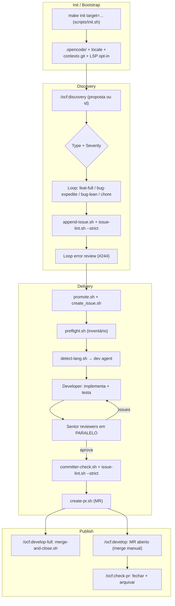
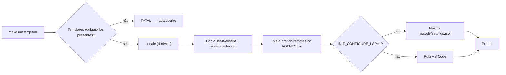
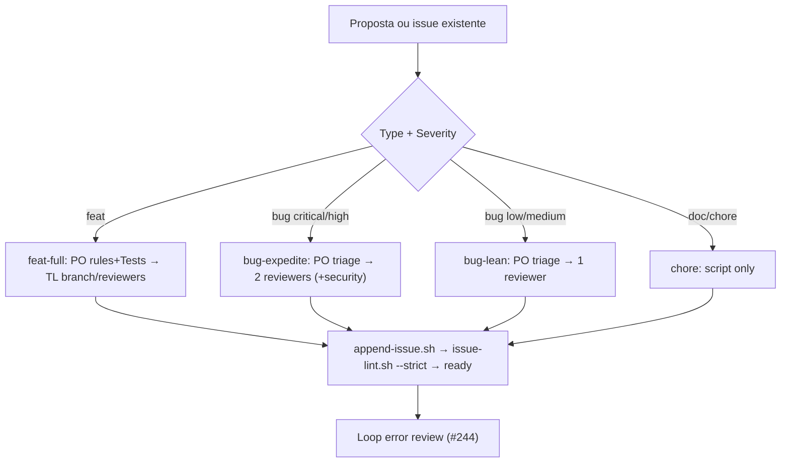
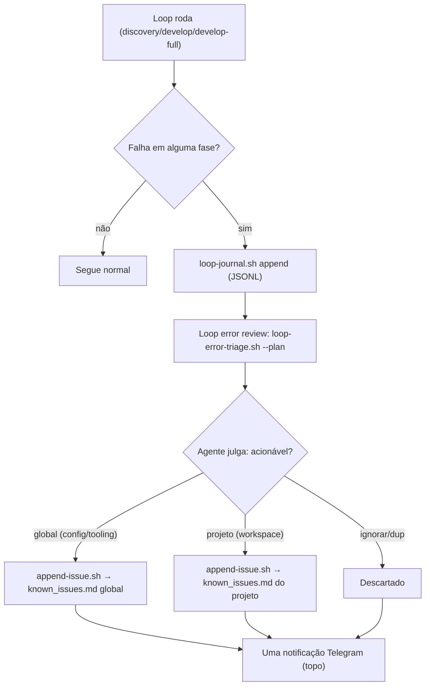
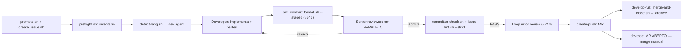
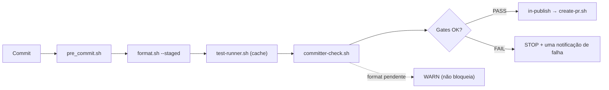
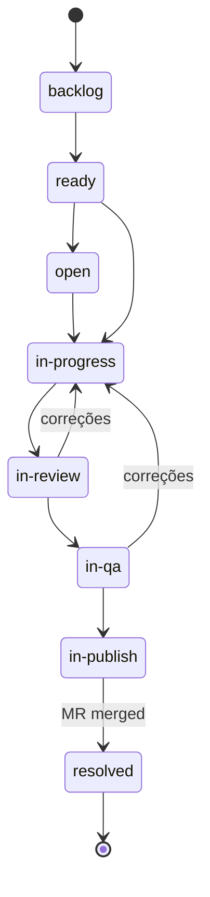
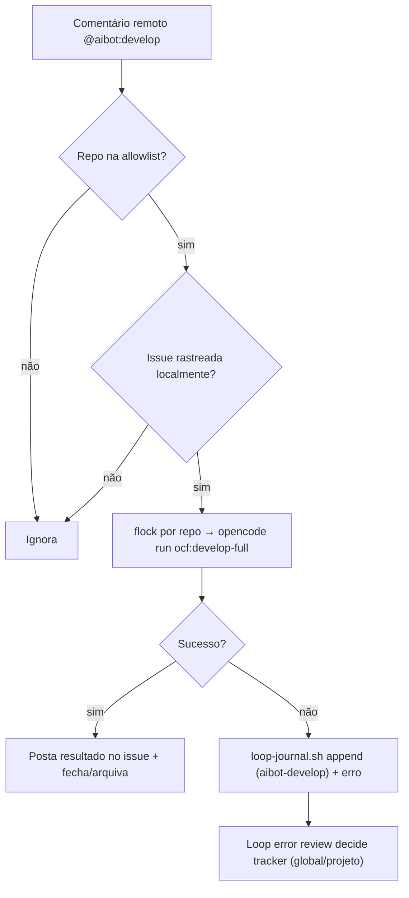

# Fluxos do Pipeline — opencode-flow

Este documento descreve, de ponta a ponta, os fluxos executados por esta
configuração: **init/bootstrap**, **discovery**, **loop error review**,
**delivery**, **gates (committer + formatter)**, **merge/arquivamento** e o
gatilho remoto **aibot-watcher**.

> Documentação visual equivalente (diagramas Mermaid) também está no
> [`README.md`](../README.md). A definição canônica de regras continua em
> [`workflow.md`](../workflow.md).

---

## 1. Visão geral (end-to-end)

Do projeto novo até o merge arquivado:

---

## 2. Init / Bootstrap

Comando: `/ocf:init` ou `make init target=<path> [locale=xx]`.

Responsabilidades:

- Copiar o template `.opencode/` **sem sobrescrever** arquivos do projeto
  (set-if-absent; `--force` para forçar).
- Resolver o locale em 4 níveis: argumento explícito → `.opencode/locale` do
  projeto-alvo (se existir) → `~/.config/opencode/locale` global → `en`.
- Injetar contexto do repositório no `AGENTS.md` (`__DEFAULT_BRANCH__`,
  `__REMOTES__`); portável GNU/BSD (`p_sed`, `mktemp`, `LC_ALL=C`).
- Sweep reduzido: remove apenas artefatos de template
  (`node_modules/`, `preflight/`, `reviews/`, `adorable-proposal/`, `package.json`,
  `package-lock.json`); **nunca** `standards/`, `README.md`, `resolved_issues.md`.
- LSP/VS Code **opt-in** (`INIT_CONFIGURE_LSP=1` ou `--lsp`).
- Preflight atômico: template obrigatório ausente → `FATAL` e nenhuma escrita.

Ver `commands/ocf:init.md` e `standards/` (script `scripts/init.sh`).

---

## 3. Discovery

Comando: `/ocf:discovery [proposal | id]`.

1. Resolve o tracker (`known_issues.md` do projeto primeiro, global como
   fallback).
2. Classifica por `- Type:` + `- Severity:` e escolhe o **loop**.
3. Executa o subagente `development/discovery`, que termina escrevendo a entrada
   canônica com `scripts/append-issue.sh` e validando com
   `scripts/issue-lint.sh --strict`.
4. **Loop error review** (issue #244) — revisa os erros do loop e registra
   issues quando aplicável.
5. Uma única notificação Telegram.

| Loop | Gatilho | Agentes de discovery | Reviewers de delivery | Barra |
|------|---------|----------------------|-----------------------|-------|
| `feat-full` | `feat` | PO (regras+`Tests:`) → TL (branch/reviewers) | do TL | cheia |
| `bug-expedite` | `bug` + `critical`/`high` | PO triage | 2 (incl. `security` se aplicável) | alta |
| `bug-lean` | `bug` + `low`/`medium` | PO triage | 1 | normal |
| `chore` | `doc`/`chore` | nenhum (script) | 1 | leve |

Ver `workflow.md` § Loop Profiles e `standards/issues.md`.

---

## 4. Loop Error Review (#244)

Cada loop (discovery, develop, develop-full, aibot-develop) registra falhas em
um **journal** estruturado (JSONL). Um agente revisor avalia o journal e
roteia os erros acionáveis para o tracker **global** (config do opencode) ou do
**projeto** onde o loop rodou.

- Journal: `<workspace>/.opencode/loop-journal/loop-<loop>-<id>.jsonl`
  (produtor: `scripts/loop-journal.sh append`).
- Triagem: `scripts/loop-error-triage.sh --plan` (gera digest + propostas) e
  `--apply` (cria issues `bug` canônicas via `append-issue.sh`).
- Agente: `agents/development/loop-error-reviewer.md`; comando manual:
  `/ocf:triage-errors`.
- Non-blocking e idempotente (dedup por `Location` + comando).

Ver `standards/loop-journal.md`.

---

## 5. Delivery (motor achatado)

Comandos: `/ocf:develop [id...]` (até o MR) e `/ocf:develop-full [id...]`
(ponta a ponta, com auto-merge). **Não há agente orquestrador** no caminho
crítico — o comando dirige os scripts; agentes aparecem só para julgamento
(developer e senior reviewers).

- `/ocf:develop-full`: auto-merge, checkout da base atualizada, close+archive,
  **uma** notificação Telegram no fim.
- `/ocf:develop`: para no MR (issue permanece `in-publish`); fechamento via
  `/ocf:check-pr`.

---

## 6. Gates — Committer + Formatter (#246)

Antes do commit/committer, o formatador do projeto roda automaticamente:

- `scripts/format.sh` — detecta Prettier (somente se configurado via
  `.prettierrc*`/`prettier.config.*`/`prettier` no `package.json`), `gofmt`,
  `shfmt`, `ruff`/`black`; modos `--staged` (default), `--all`, `--diff <range>`,
  `--check`; skip gracioso quando não há formatter.
- `scripts/pre_commit.sh` — roda `format.sh --staged` antes dos testes e
  re-estagia apenas os arquivos reescritos que não tinham alterações não-staged
  prévias.
- `scripts/committer-check.sh` — WARN **não-bloqueante** escopado ao diff da
  branch (`format.sh --diff <merge-base>...HEAD --check`).

Ver `standards/formatting.md` e `standards/code-review.md`.

---

## 7. Ciclo de vida e arquivamento

Timestamps são gravados pelos scripts: `create_issue.sh` (`Opened`),
`promote.sh` (`Ready`/`Started`), `transition.sh` (`In review`, `In QA`,
`In publish`), `close_issue.sh` (`Resolved` + `Durations`).

---

## 8. aibot-watcher (gatilho remoto, #39)

Timer systemd (`OnCalendar=*:0/2`) que lê comentários de issues remotas e
dispara o pipeline equivalente a `/ocf:develop-full`.

Sem polling de merge: o watcher só observa comentários; o merge é feito pelo
`/ocf:develop-full`. Ver `workflow.md` § Remote Entry Point.

---

## 9. Referência rápida de scripts

| Script | Papel |
|--------|-------|
| `scripts/init.sh` | init/bootstrap idempotente e portável |
| `scripts/append-issue.sh` | escreve entrada canônica de issue |
| `scripts/issue-lint.sh` | valida schema (`--strict`) |
| `scripts/promote.sh` | promove issue e cria branch `issue-<id>-<slug>` |
| `scripts/preflight.sh` | inventário de arquivos para o loop |
| `scripts/detect-lang.sh` | escolhe o agente de desenvolvimento |
| `scripts/format.sh` | formatador antes do commit |
| `scripts/pre_commit.sh` | gate de pré-commit (formatter + testes) |
| `scripts/loop-journal.sh` | journal de erros por loop |
| `scripts/loop-error-triage.sh` | classifica e registra erros |
| `scripts/committer-check.sh` | gate do committer |
| `scripts/create-pr.sh` | cria o MR |
| `scripts/merge-and-close.sh` | auto-merge + close + archive |
| `scripts/transition.sh` | transições de status |
